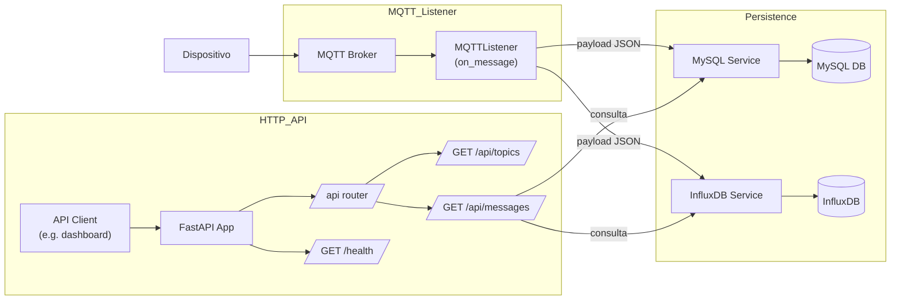

## API 01

### Procesamiento de Informacion y Registro en BD

Esta API funcionara como el nodo conector entre el dispositivo fisico y las Bases de datos
Purgara la informacion, y ordenara, y posteriormente registrara en los formatos adecuador para poder reflejar los datos de manera informativa, y en tiempo real. 
La misma escuchara de forma pasiva los mensajes presnetes en los topicos en que los dispositivos registren sus lecturas, corriendo en un contenedor Docker, conectado a la red donde se desplegaran asi mismo la base de datos en MySQL e InfluxDB.

---

### Estructura del Directorio

- 📦Backend
-  ┣ 📂app                          // Directorio principal de la aplicacion
-  ┃ ┣ 📂api                        // Elementos de inico de la AIP y gestion de routas [host/api]
-  ┃ ┃ ┣ 📜routes.py                // Gestor de rutas definidas en la aplicacion
-  ┃ ┃ ┗ 📜__init__.py              // Elemento importador de los endpoind del directorio 
-  ┃ ┣ 📂models                     // Elementos asociado a modelos predefinidos, de momento solo estructura de los mensajes recividos
-  ┃ ┃ ┗ 📜mensaje.py               // Estructurador de formato de los mensjaes
-  ┃ ┣ 📂services                   // Estructura la conexion con los diferentes servicios a los que conecta la API
-  ┃ ┃ ┣ 📜influx_serv.py           // Estructura conexion con la base de datos en Influx
-  ┃ ┃ ┗ 📜mysql_serv.py            // Estructura conexion con la base de datos en MySQL
-  ┃ ┣ 📂utils
-  ┃ ┃ ┗ 📜logger.py                // Gestiona los logs del sistema, asi como la categorizacion de los mismos
-  ┃ ┣ 📜config.py                  // Configuracion de la aplicacion y sus endpoints. Estps son llamados del .env
-  ┃ ┣ 📜main.py                    // Cuerpo de la aplicacion. Inicio, gestion del listener, del healtcheck, y ruta principal  
-  ┃ ┣ 📜mqtt_listener.py           // Listener en segundo plano de las conexiones y topicos MQTT
-  ┃ ┗ 📜__init__.py
-  ┣ 📜.env                         // Documento de enviroment donde se definen los valores finales antes de desplegar
-  ┣ 📜.gitignore                   
-  ┣ 📜docker-compose.yml           // Docke-compose para creacion y parametros del contenedor
-  ┣ 📜Dockerfile
-  ┣ 📜README.md
-  ┗ 📜requirements.txt             // Librerias/instalaciones que deben ejecutarse en la imagen del contenedor

---

### Instacion solicitadas en el "requirements.txt"
- fastapi
    - Framework web asíncrono sobre el que montamos nuestros endpoints y el ciclo de vida de la app.
- uvicorn[standard]
    - Servidor ASGI ligero para ejecutar FastAPI, con extras ([standard]) como watchdog para recarga en caliente.
- paho-mqtt
    - Cliente MQTT para suscribirte a topics y procesar mensajes.
- mysql-connector-python
    - Driver oficial de Oracle para conectar a MySQL desde Python.
- influxdb-client
    - Cliente oficial para lectura/escritura en InfluxDB 2.x.
- python-dotenv
    - (Opcional si tu editor o entorno no carga .env automáticamente) permite que Pydantic BaseSettings lea tu .env.
- sqlalchemy
    - ORM/kit de conexión SQL que te facilitará abstraer consultas y gestión de sesiones en MySQL.

---

### Flujo de Datos

